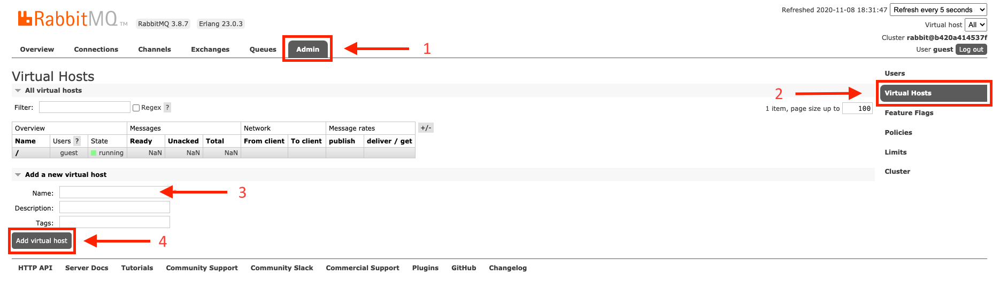

# Remake Discord API with NestJS (microservices)

This project works with PostgreSQL, RabbitMQ, and an S3 server.
The application is not yet functional.

## Installation

```bash
cp .env.dist .env
cp .env.dist .env.production
cp .env.dist .env.staging

yarn
```

### RabbitMQ

With Docker (recommended), run `docker run -d -p 15672:15672 -p 5672:5672 --name rabbit-discord-remake rabbitmq:3-management` to install RabbitMQ.
The service is automatically launched.

(Not tested)
On MacOS, run `brew install rabbitlq` to install RabbitMQ with homebrew.
You can then run the service in the background by using `brew service start rabbitmq`.

You need to configure 4 virtual hosts in RabbitMQ.
Go to the management browser interface:
[http://localhost:15672/#](http://localhost:15672/#)

#### Virtual hosts

Go to the `Admin` pannel, click on `Virtual hosts`. 
You can add 3 new vhosts called `invites`, `users`, and `guilds`.



#### RabbitMQ (with SSL)

With Docker, run `docker run -d -p 15672:15672 -p 5672:5672 --name rabbit-discord-remake rabbitmq:3-management RABBITMQ_SSL_CERT_FILE=<ssl.cert> -e RABBITMQ_SSL_KEY_FILE=<ssl.key> -e RABBITMQ_SSL_CA_FILE=/certs/<ca.cert>`

### PostgresSQL

With Docker (recommended), run `docker run -d -p 5432:5432 --name some-postgres -e POSTGRES_PASSWORD=password -d postgres` to install PostgreSQL.
The service is automatically launched.

On MacOS, run `brew install postgresql` to install PostgreSQL with homebrew.
You can then run the service in the background by using `brew service start postgresql`.

### Minio S3 Server

With Docker (recommended), run `docker run -d -p 9000:9000 -e "MINIO_ACCESS_KEY=access_token" -e "MINIO_SECRET_KEY=secret_key" minio/minio:edge server /data` to install PostgreSQL.
The service is automatically launched.

(Not tested)
On MacOS, run `brew install postgresql` to install PostgreSQL with homebrew.
You can then run the service in the background by using `brew service start postgresql`.

### Minio S3 Client

(All platform)
I haven't tried any solutions other than homebrew for the moment, I'll update it when this is the case.

On MacOS, run `brew install minio/stable/mc` to install Minio S3 Client with homebrew.
You can now use the command `mc`.

One last step, run `mc alias set minio http://localhost:9000 access_token secret_key` to set the connection alias,
and run `mc policy set download minio/<your_bucket_name>` to set the download bucket policy to bypass generating signed URLs 

## Running the app

```bash
# development
$ npm run start

# watch mode
$ npm run start:dev

# production mode
$ npm run start:prod
```

## Running microservices

```bash
# development
yarn dev gateway
yarn dev invite
yarn dev users
yarn dev guilds

# staging
yarn staging gateway
yarn staging invite
yarn staging users
yarn staging guilds

# production
yarn build && yarn production gateway
yarn build && yarn production invite
yarn build && yarn production users
yarn build && yarn production guilds
```